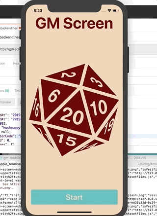
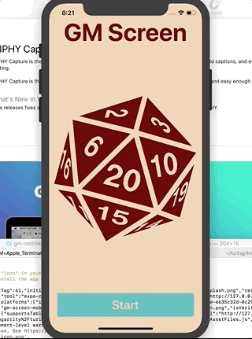

# GM-Screen-Mobile

GM-Mobile is the player answer to our Game Master role playing framework. Working in conjunction with our desktop app our own backend game/accounts API a Game Master and Players can feel even more immersed in their gameplay experience with event push notifications, character creation, and inventory management.

### ScreenShots

### APIs Used
* [GM-Screen-BackEnd](https://gm-screen-backend.herokuapp.com)
* [BackEnd Docs](https://github.com/bghalami/gm_screen_backend)

### Primary Javascript technologies
* React-Native
* React-Native Navigation
* Eslint

### See it Live

#### Setup

1. Clone down repo
2. `npm install` from root directory
3. `npm start` and visit the browser window up opened by `expo`
4. Download `Expo` app to a mobile device or open in IOS/Android Simulator
5. Open the app and select scan QR code then scan
6. The `Javascript` will compile then run

### Test Driven Development

GM-Mobile uses Jest and Enzyme for all testing purposes

`npm test` from the associated root directory

### Original Assignment

[Cross-Pollination Project](http://frontend.turing.io/projects/capstone.html) from the Turing School of Software & Design

### Contributors

Tim Garrity: [Github](https://github.com/Salamandastron1) 
